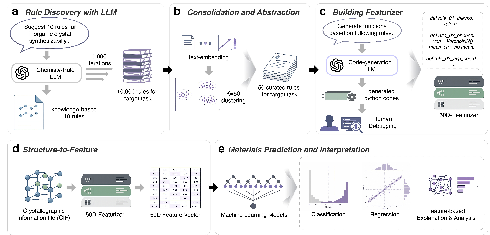

<div align="center">
  
  <h1>CRISP</h1>
  <p><strong>Compiling chemical knowledge into executable descriptors for materials prediction</strong></p>
  <p>
    
    
    
    
  </p>
</div>

CRISP is an LLM-assisted workflow for turning target-relevant chemical knowledge into compact, inspectable programs. The LLM explores and organizes chemical rules, then compiles each retained rule into a scalar descriptor. A conventional learner—not the LLM—consumes the resulting descriptor vector.

No task-specific LLM fine-tuning or large-corpus training is required: representation construction is performed through auditable API calls, and the resulting descriptor code can be inspected independently of the language model.

This repository is a **methodology and protocol release**. It contains the code and configuration needed to rerun the dataset-blind rule-compilation workflow with the OpenAI API, together with the published 50-rule synthesizability catalog. It intentionally excludes frozen descriptor implementations, structure featurizers, benchmark data, targets, splits, trained predictors, score vectors, and reported results.

## Design



The separation is deliberate. During representation construction, the API receives prompts and generated rule text only—never structures, material identifiers, labels, target values, train/test assignments, predictions, residuals, or benchmark metrics. This reduces target leakage and limits teacher-model bias from pretrained property predictors or learned surrogates.

## Install

```bash
git clone https://github.com/snu-micc/CRISP.git
cd CRISP
python -m venv .venv
source .venv/bin/activate
pip install -e .
```

Set your API key without committing it:

```bash
cp .env.example .env
# edit .env locally and add OPENAI_API_KEY
```

## Reproduce the compilation workflow

Start with the inexpensive protocol check:

```bash
crisp compile \
  --config configs/quickstart.json \
  --output runs/quickstart
```

This makes a small number of discovery calls, embeds and clusters the returned rules, consolidates each cluster, generates one descriptor function per cluster, and writes a provenance manifest. Generated Python is parsed and statically audited but **never executed automatically**.

The paper-scale synthesizability settings are frozen in [`configs/paper_synthesizability.json`](configs/paper_synthesizability.json):

```bash
crisp compile \
  --config configs/paper_synthesizability.json \
  --output runs/synthesizability_full
```

> [!IMPORTANT]
> The paper-scale run requests 1,000 discovery responses and incurs API cost. Review the configuration before starting. LLM sampling is stochastic, so this reproduces the documented protocol and provenance—not a byte-identical catalog.

Available target prompts are:

- `synthesizability`
- `formation_energy`
- `ionic_conductivity`
- `shear_modulus`

To compile a new target, copy a configuration, select or add a dataset-blind prompt in [`crisp/prompts.py`](crisp/prompts.py), and keep the target-leakage policy enabled. Detailed stage outputs and audit fields are described in [Reproducibility guide](docs/REPRODUCIBILITY.md).

## Inspect the published rule catalog

The published 50-rule synthesizability catalog is listed in [`catalogs/synthesizability_rules.json`](catalogs/synthesizability_rules.json). It provides rule names and operational summaries for scholarly inspection. The frozen descriptor implementations used in the reported experiments are not distributed in this repository.

Running `crisp compile` creates a new set of candidate descriptor functions from the disclosed prompts and configuration. Generated code is stochastic, is not the frozen study catalog, and must be reviewed before execution.

## Repository map

```text
CRISP/
├── assets/                         # README artwork
├── catalogs/                       # released rule names and operational summaries
├── configs/                        # quick-start and paper-aligned protocols
├── crisp/
│   ├── workflow.py                 # API compilation pipeline
│   ├── prompts.py                  # frozen dataset-blind prompt templates
│   └── audit.py                    # generated-code static gate
├── docs/                           # release boundary and reproduction notes
└── tests/                          # offline parser and audit tests
```

## Reproducibility contract

Every compilation run records:

- configuration and model identifiers;
- prompt and source-file SHA-256 hashes;
- UTC timestamps and package versions;
- parsed rule counts and cluster assignments;
- consolidated rules and generated functions;
- static-gate findings for each function;
- API response identifiers and token usage where available.

Raw run directories are ignored by Git by default. Preserve them privately if they are needed for an audit.

## Citation

The manuscript citation will be added after publication. Until then, please cite this repository and the preprint https://arxiv.org/abs/2608.27587.

## Contact

Jaehwan Choi · [jaehwan.micc@gmail.com](mailto:jaehwan.micc@gmail.com)<br>
Materials Intelligence and Computational Chemistry Laboratory, Seoul National University
